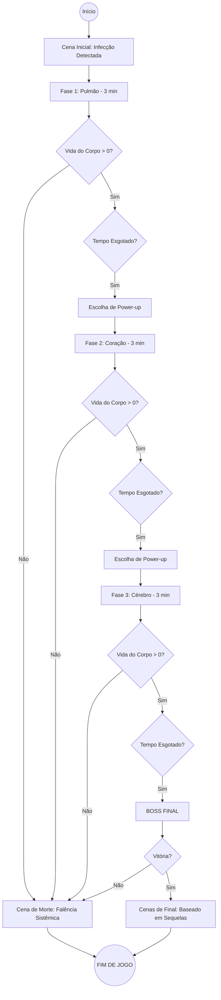
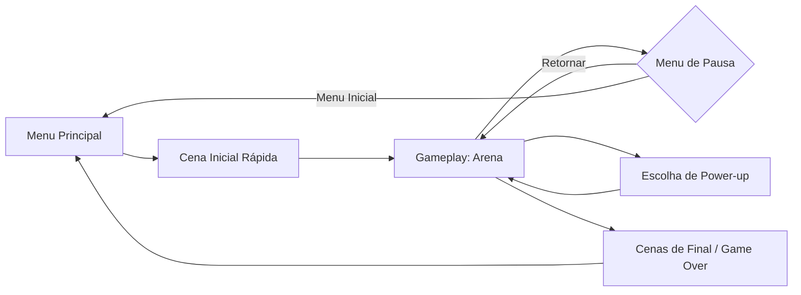

# GDD: Virus Arena - Documento de Design

# 1. Página de Título

**Título do Jogo:** Virus Arena

---

### **Sistemas de Jogo Previstos**
**Shooter Tower Defense 2D:** O jogador assume o papel de um glóbulo branco em uma arena fixa. O jogo combina a movimentação ágil e o combate de tiro lateral (estilo Metal Slug) com a estratégia de defesa de território, onde o objetivo é impedir que vírus invasores destruam os órgãos vitais que compõem o cenário.

---

### **Público-Alvo e Classificação**
* **Faixa Etária Recomendada:** 10+ anos.
* **Classificação Indicativa ESRB Pretendida:** E10+ (Everyone 10+).
---

### **Data de Lançamento Prevista**
* **Conclusão do Projeto:** 08/05/2026.

# 2. ESBOÇO DO JOGO

### **Resumo da História**
O jogo narra a batalha microscópica pela sobrevivência humana. O jogador é um **Glóbulo Branco**, a última linha de defesa do organismo. A missão é proteger órgãos vitais de uma invasão viral. A jornada começa nos **Pulmões**, avança pelo **Coração** e culmina no **Cérebro**. O destino do hospedeiro humano depende da eficiência do jogador em conter os danos em cada área.

### **Ângulo de Câmera e Localização**
* **Câmera:** Visão 2D lateral fixa em formato de arena quadrada (estilo *Single-Screen Shooter*).
* **Localização:** O interior do corpo humano. O cenário é estático em cada fase, representando o tecido do órgão atual (Pulmão, Coração e Cérebro).

### **Fluxo do Jogo e Progressão**
* **Estrutura de Níveis:** O jogo possui 3 níveis principais com 2 transições de cenário.
* **Sistema de Power-ups:** Ao vencer um nível, o jogador deve escolher **um entre três** aprimoramentos para a próxima etapa:
    1. **Tiro Triplo:** Aumenta a área de cobertura do ataque.
    2. **Mais Velocidade:** Melhora a agilidade de movimentação e salto.
    3. **Resistência Celular:** Adiciona +1 coração ao jogador e recupera 30% da vida total do corpo.
* **Condição de Vitória:** Sobreviver às hordas nos três órgãos. A vitória final é alcançada se a vida total do corpo permanecer acima de zero ao fim da fase do Cérebro.

### **Mecânicas de Dano e Multiplicadores**
O cenário (corpo) possui **1500 de vida total**, mas cada órgão tem uma tolerância e um impacto diferente na saúde geral:
* **Dano Local:** Se um órgão sofrer dano excessivo (ex: 500 pontos), o jogador "perde" aquela fase, mas o jogo continua para a próxima, com consequências na história.
* **Multiplicadores de Impacto:** O dano ao corpo é relativo à importância do órgão:
    * **Pulmão (Nível 1):** Multiplicador x1 (10 de dano no cenário = 10 no corpo).
    * **Coração (Nível 2):** Multiplicador x2 (10 de dano no cenário = 20 no corpo).
    * **Cérebro (Nível 3):** Multiplicador x3 (10 de dano no cenário = 30 no corpo).

### **Sistema de Desfecho (Finais Alternativos)**
O final do jogo é determinado pelo estado de preservação dos órgãos e do corpo:
* **Final Perfeito:** Todos os órgãos defendidos com sucesso; o humano sobrevive saudável.
* **Final com Sequelas:** Se o jogador perdeu a vida de um cenário específico (ex: Pulmão), a cutscene final mostra o humano vivo, mas com problemas crônicos naquele órgão.
* **Final de Falência Sistêmica:** Se a vida total do corpo (1500) chegar a zero em qualquer momento, o humano morre e o jogo termina em *Game Over*.
------

# 3. PERSONAGENS

### **O Protagonista: Glóbulo Branco (Unidade de Defesa)**

*   **História Pregressa:**
    O protagonista é uma célula de defesa de elite, gerada na medula óssea e enviada às pressas para as zonas críticas de infecção. Ele não é apenas um soldado, mas a última barreira entre a vida e a falência sistêmica. Sua missão começou nos Pulmões, mas a gravidade da invasão o forçará a viajar pelos canais arteriais até o centro do pensamento humano.
    
*   **Personalidade e Reação aos Desafios:**
    Como uma sentinela programada para a proteção, sua personalidade é de sacrifício. Ele reage aos desafios de forma adaptativa: ao encontrar novos patógenos, ele sofre mutações (Power-ups) para aumentar sua eficácia. Sua principal característica é a resiliência, mantendo-se firme mesmo quando o cenário ao seu redor começa a degradar-se.

*   **Relação com a Jogabilidade:**
    O personagem possui uma natureza dual única: ele é simultaneamente uma **arma** (capaz de eliminar vírus com disparos) e um **escudo** (capaz de absorver projéteis que destruiriam o corpo, mas que não o ferem). Essa dinâmica exige que o jogador alterne constantemente entre atacar inimigos e posicionar o próprio corpo para proteger o órgão.

### **Movimentos e Habilidades Característicos**
*   **Disparo Biológico:** Ataque primário para eliminar ameaças à distância.
*   **Salto Defensivo:** Essencial para alcançar vírus voadores e navegar entre as plataformas fixas e móveis que surgem conforme a infecção avança.
*   **Interceptação de Projéteis:** Capacidade de colidir com tiros específicos para anular o dano ao cenário (sistema de "Body Block").

### **Mapa de Controles (PC)**

| Comando | Ação |
| :--- | :--- |
| **A / D** (ou Setas) | Movimentação Lateral (Esquerda/Direita) |
| **W / Espaço** | Pulo (Navegação em plataformas fixas e móveis) |
| **Mouse (Movimento)** | Mirar em 360° |
| **Botão Esquerdo Mouse** | Atirar (Disparo Biológico) |
| **ESC / P** | Pausar o Jogo / Menu de Opções |

------ 
# 4. GAMEPLAY

### **Gênero do Jogo**
**Virus Arena** é um **Shooter 2D de Sobrevivência Cronometrada** com elementos de **Tower Defense**. O foco não é apenas eliminar todos os inimigos, mas resistir à invasão e proteger o cenário durante um tempo determinado, gerenciando o dano acumulado nos órgãos.

### **Estrutura de Progressão e Ciclo de Jogo**
O jogo é dividido em **3 Cenários Críticos**. Cada cenário possui uma duração fixa de **3 minutos**. Conforme o cronômetro avança dentro de cada fase, a intensidade aumenta:
* **Escalonamento Interno:** A velocidade dos inimigos, a quantidade de hordas simultâneas e o dano causado ao corpo aumentam progressivamente até o fim dos 3 minutos.
* **Transições:** Ao sobreviver ao tempo de cada órgão, o jogador acessa a tela de seleção de **Power-ups** (Tiro Triplo, Velocidade ou Resistência Celular) antes de seguir para o próximo nível.

### **Detalhamento das Fases e Mecânicas de Cenário**

1. **Capítulo 1: Pulmão (Nível de Entrada)**
   * **Duração:** 3 Minutos.
   * **Cenário:** Chão plano e estável.
   * **Dinâmica:** Introdução ao combate e à mecânica de interceptação de tiros.

2. **Capítulo 2: Coração (Nível Intermediário)**
   * **Duração:** 3 Minutos.
   * **Cenário:** Introdução de **Plataformas Fixas**.
   * **Dinâmica:** Exige saltos precisos para bloquear tiros que miram as partes altas do órgão.

3. **Capítulo 3: Cérebro (Nível Final)**
   * **Duração:** 3 Minutos + **Boss Fight**.
   * **Cenário:** Presença de **Plataformas Móveis**.
   * **Dinâmica:** Após resistir aos 3 minutos de hordas intensas, o cronômetro para e surge o **Grande Vírus Mestre (Boss)**, exigindo que o jogador utilize todos os power-ups acumulados para sobreviver e salvar o hospedeiro.

### **Recursos Específicos da Plataforma (PC)**
* **Interface de Cronômetro:** HUD dedicada que mostra o tempo restante e a integridade do órgão atual em tempo real.
* **Feedback Visual de Dano:** O cenário sofre alterações estéticas (escurecimento ou pulsações irregulares) conforme a vida do órgão diminui, alertando o jogador sobre a proximidade da falência.
* **Precisão de Mira:** O uso do mouse é vital para alternar rapidamente entre o "Atirador Anti-Corpo" (prioridade de defesa) e o "Atirador Anti-Player" (prioridade de desvio).

---

# 5. MUNDO DO JOGO

### **Atmosfera Geral**
O mundo de **Virus Arena** é claustrofóbico e urgente. A estética visual mistura tons biológicos (vermelhos, rosas e azuis venosos) com efeitos de luz que indicam a presença da infecção (tons de verde neon ou roxo doentio). A música escala de um ritmo constante para batidas frenéticas conforme o cronômetro se aproxima do fim.

### **Ambientes e Biomas**

| Local | Descrição Visual | Elementos de Gameplay | Clima Sonoro |
| :--- | :--- | :--- | :--- |
| **1. Alvéolos Pulmonares** | Tons de rosa claro e azul. Fundo com estruturas que inflam e desinflam suavemente. | **Chão Plano:** Arena aberta para aprendizado de movimentação. | Som de respiração profunda ao fundo; trilha sonora calma mas persistente. |
| **2. Ventrículo Cardíaco** | Tons de vermelho vibrante e carmesim. Paredes musculares que pulsam visualmente. | **Plataformas Fixas:** Estruturas de válvulas cardíacas que servem de suporte alto. | Trilha rítmica baseada em batidas de coração (Tum-Tum) que acelera com o tempo. |
| **3. Córtex Cerebral** | Tons de cinza, roxo e dourado. Sinapses elétricas (raios) cruzando o fundo. | **Plataformas Móveis:** Impulsos elétricos que sustentam plataformas flutuantes. | Música eletrônica complexa e "tensa", com sons de estática e eletricidade. |

### **Conexão Narrativa e Visual**
Os locais estão conectados pelo fluxo sanguíneo. Entre as fases, uma animação simples mostra o Glóbulo Branco sendo transportado por uma "correnteza" de plasma até o próximo órgão alvo da infecção. 

*   **Degradação do Mundo:** Conforme a vida do cenário diminui, as cores vibrantes tornam-se acinzentadas e "murchas", indicando a necrose do tecido e aumentando o sentimento de culpa/urgência no jogador.

### **Fluxograma de Navegação (Mundo)**

------#

# 6. EXPERIÊNCIA DE JOGO

### **O Sentimento Principal**
O foco é a **Urgenta e Defesa**. O jogador deve sentir que é a última barreira de proteção. A experiência é pautada pelo gerenciamento de riscos: "Devo focar em eliminar o vírus ou usar meu corpo para bloquear o dano ao órgão?". A pressão do cronômetro de 3 minutos mantém o ritmo constante de adrenalina.

### **A Primeira Impressão (Tela Inicial)**
Para viabilidade do projeto (equipe de 2 desenvolvedores), a tela inicial será minimalista e funcional:
*   **Visual:** Fundo estático com arte estilizada de uma artéria ou tecido orgânico em tons de vermelho escuro. O título "Virus Arena" centralizado com efeito de pulsação suave.
*   **Menu Direto:** Botões simples de "Jogar", "Tutorial/Créditos" e "Sair".
*   **Início de Jogo:** Ao clicar em Jogar, uma breve cena de 5 segundos (estilo HQ ou texto rápido) contextualiza a invasão nos pulmões e lança o jogador na arena.

### **Interface do Usuário (HUD)**
A interface foi desenhada para priorizar a leitura rápida do estado do corpo e do tempo:

*   **Superior Central:** Cronômetro regressivo (Iniciando em 3:00).
*   **Inferior (Extensão Total):** Barra de vida do **Corpo** (1500 HP), ocupando a largura da tela para indicar a importância vital.
*   **Canto Inferior Esquerdo (Abaixo da barra):** Ícones de 5 corações (Vida do Glóbulo Branco).
*   **Canto Inferior Direito (Abaixo da barra):** Indicador numérico ou barra menor de vida do **Órgão Atual** (Ex: Pulmão - 500/500).

### **Design de Som e Feedback**
*   **Ambiente:** Som ambiente abafado de batidas cardíacas que aumenta de volume nos últimos 30 segundos de cada fase.
*   **Feedback Visual:** O personagem pisca em vermelho ao levar dano; a barra de vida do corpo treme levemente quando um projétil atinge o cenário.

### **Fluxograma de Navegação (Interface)**

-----

# 7. MECÂNICAS DE JOGO

### **Mecânicas de Interação (Plataformas e Arena)**
A arena quadrada evolui de uma caixa simples para um ambiente de defesa multidirecional. O "corpo" (cenário) recebe dano se projéteis atingirem as superfícies protegidas:

1.  **Nível 1 (Pulmão) - Arena Base:** 
    *   **Estrutura:** Chão plano e paredes simples.
    *   **Foco:** Defesa prioritária do solo. O jogador se movimenta apenas no plano horizontal.

2.  **Nível 2 (Coração) - Defesa Lateral:** 
    *   **Estrutura:** Chão normal + **Plataformas Fixas** posicionadas próximas às paredes laterais.
    *   **Mecânica:** As paredes também passam a sofrer dano. O jogador deve usar as plataformas para subir e interceptar tiros que miram as laterais do coração.

3.  **Nível 3 (Cérebro) - Defesa Total:** 
    *   **Estrutura:** Chão normal + **Plataformas Móveis** (sobe/desce).
    *   **Mecânica:** O teto da arena também se torna um ponto vulnerável. O jogador precisa utilizar o "timing" das plataformas móveis para alcançar a parte superior da arena e bloquear projéteis que subiriam para atingir o teto (córtex).

### **Perigos de Colisão (Dano ao Cenário)**
O cenário possui hitboxes em suas extremidades (Chão, Paredes e Teto). 
*   **Impacto Viral:** Qualquer projétil do "Atirador Anti-Corpo" ou o corpo do "Kamikaze" que colidir com essas hitboxes subtrai HP da barra de 1500 do corpo, aplicando o multiplicador do órgão atual (x1, x2 ou x3).

### **Itens e Power-ups (Mecânica de Evolução)**
Ao final de cada fase de 3 minutos, o jogador escolhe **uma** entre três mutações:

| Power-up | Efeito Técnico | Vantagem Estratégica |
| :--- | :--- | :--- |
| **1. Tiro Triplo** | Disparo em leque (3 projéteis por vez). | Ideal para limpar grupos de vírus e atingir Kamikazes em ângulos difíceis. |
| **2. Mais Velocidade** | Aumento na velocidade de movimento e altura do pulo. | Crucial para transitar entre o chão e as plataformas móveis no Cérebro. |
| **3. Vitalidade Extra** | +1 Coração e restaura 30% da vida total do corpo. | Aumenta a margem de erro para quem sofreu muito dano nos níveis anteriores. |

### **Mecânica de Bloqueio (Body Block)**
O diferencial do jogo é a gestão de colisões do personagem:
*   **Intercepção:** O Glóbulo Branco é imune aos tiros amarelos (Anti-Corpo). O jogador deve usar o personagem como um "escudo móvel", posicionando-se na trajetória desses tiros para que eles batam nele e desapareçam antes de tocar as paredes, teto ou chão.

---
